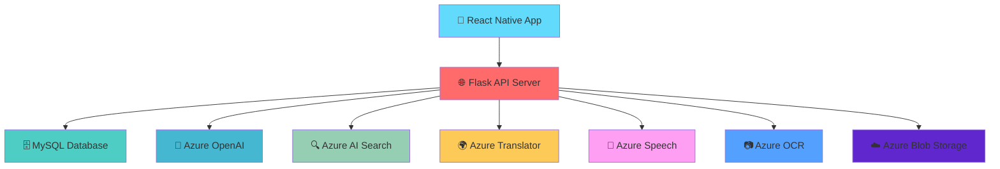
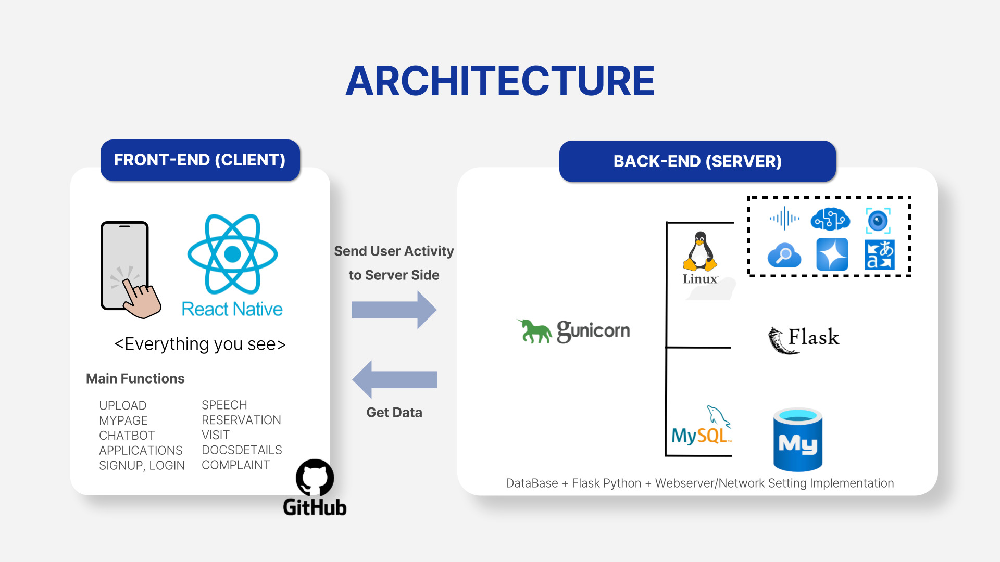
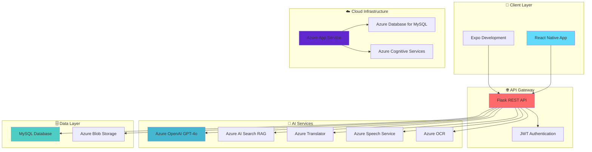
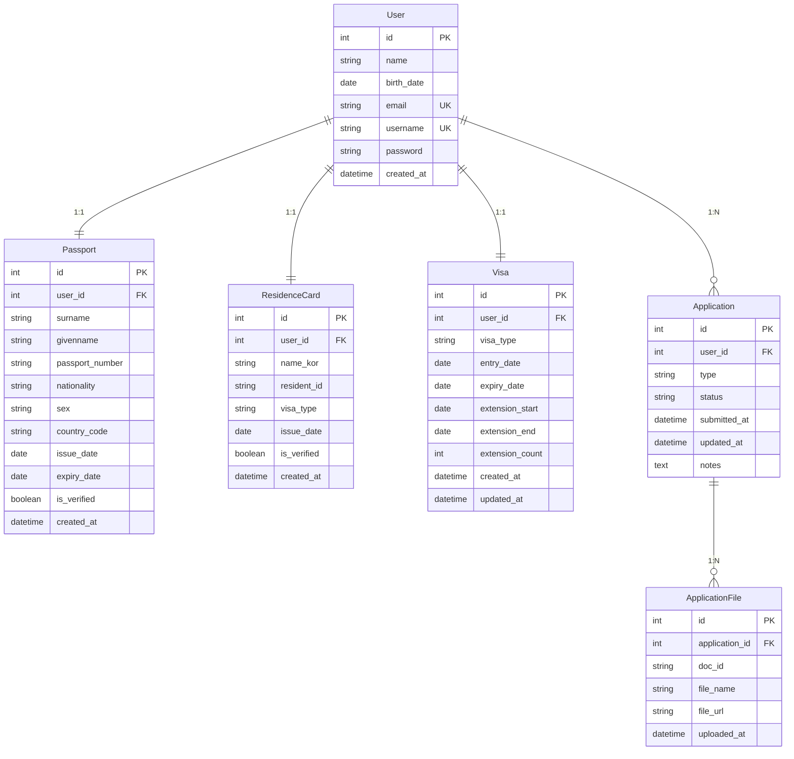
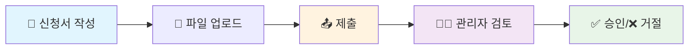
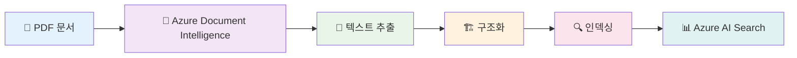
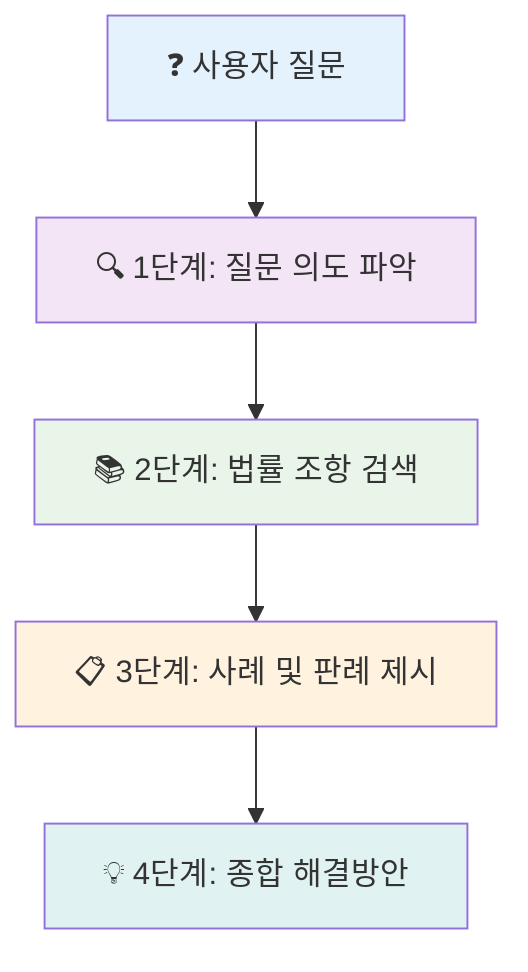

<div align="center">

# 🚀 EasyFormy (이지포미)

### 외국인을 위한 AI 민원 서비스

[](https://reactnative.dev/)
[](https://flask.palletsprojects.com/)
[](https://azure.microsoft.com/services/openai/)
[](https://www.mysql.com/)
[](LICENSE)

> **외국인 비전문·계절근로자를 위한 AI 기반 종합 민원 서비스 애플리케이션**

[📱 주요 기능](#-주요-기능) • [🛠 기술 스택](#-기술-스택) • [🚀 배포 가이드](#-배포-가이드) • [📊 API 문서](#-api-엔드포인트)

</div>

---

<div align="center">


*외국인 근로자의 디지털 민원 처리를 위한 혁신적인 AI 솔루션*

</div>

## 📊 프로젝트 배경

<div align="center">

### 🎯 **우리가 해결하는 문제**

</div>

| 📈 **문제 상황** | 👥 **타겟 사용자** |
|------------------|-------------------|
| 🔴 **체류 외국인 증가**: 2021년 196만 명 → 2024년 265만 명 (35% 증가) | 🎯 **외국인 비전문·계절근로자**: 약 32만 5천 명 |
| 🔴 **인프라 부족**: 정부 지원 35억 원 감소, 지원센터 인력 절반 감소 | 📊 **전체 체류 외국인의 18.7%** |
| 🔴 **현장 문제**: 언어 장벽, 복잡한 서식, 번거로운 절차 | ⏰ **특징**: 짧은 체류 기간, 높은 민원 비중, 낮은 한국어 수준 |

<div align="center">

*💡 **AI 기술로 외국인 근로자의 민원 처리를 혁신적으로 개선합니다***

</div>

## 📱 주요 기능

<div align="center">

### ✨ **핵심 기능 소개**

</div>

<details>
<summary><b>🤖 AI 챗봇 서비스</b></summary>

| 기능 | 설명 | 기술 |
|------|------|------|
| 🌍 **다국어 지원** | 80개 언어로 실시간 번역 및 대화 | Azure Translator |
| 🎤 **음성 인식/합성** | STT(Speech-to-Text) 및 TTS(Text-to-Speech) 지원 | Azure Speech Service |
| 🔍 **RAG 기반 답변** | 1,146개 문서 기반 정확한 정보 제공 | Azure AI Search |
| 🧠 **4단계 추론 프롬프팅** | 법적 해석과 판단을 위한 고도화된 AI | GPT-4o + LangChain |
| ❓ **FAQ 시스템** | 자주 묻는 질문에 대한 빠른 답변 | 자동 분류 시스템 |
| 📚 **공공데이터 활용** | 하이코리아 출입국/체류 안내 데이터 기반 | 공식 데이터 연동 |

</details>

<details>
<summary><b>📋 신청서 관리</b></summary>

| 기능 | 설명 | 특징 |
|------|------|------|
| 🛂 **E-8/E-9 비자 신청** | 외국인등록, 체류기간 연장, 근무처 변경 | 6가지 신청 유형 |
| ✍️ **통합신청서 자동 작성** | 40개 필드 분석, 실시간 PDF 생성 | 자동 필드 매핑 |
| 📄 **진정서 자동 생성** | 31개 필드, 6개 핵심 질문으로 본문 작성 | AI 기반 내용 생성 |
| ☁️ **문서 업로드** | Azure Blob Storage를 통한 안전한 파일 관리 | 암호화 저장 |
| 📊 **진행 상황 추적** | 실시간 신청 상태 확인 | 실시간 알림 |

</details>

<details>
<summary><b>👤 사용자 관리</b></summary>

| 기능 | 설명 | 기술 |
|------|------|------|
| 👤 **개인정보 관리** | 기본 정보, 여권, 외국인등록증 정보 관리 | 통합 프로필 |
| 📷 **OCR 기능** | 여권 및 외국인등록증 자동 정보 추출 | Azure OCR API |
| 🛂 **비자 정보 관리** | E-8/E-9 비자 정보 및 연장 관리 | 자동 만료일 계산 |
| ⏰ **자동 만료일 계산** | 입국일 기준 체류기간 자동 계산 | 스마트 알림 |

</details>

<details>
<summary><b>🔐 보안 및 인증</b></summary>

| 기능 | 설명 | 보안 수준 |
|------|------|-----------|
| 🔑 **JWT 토큰 기반 인증** | 안전한 사용자 인증 | 256비트 암호화 |
| 👨‍💼 **관리자 권한** | 신청서 승인/거절 및 파일 관리 | 역할 기반 접근 |
| 🔒 **데이터 암호화** | 민감한 정보 보호 | AES-256 암호화 |

</details>

## 🛠 기술 스택

<div align="center">

### 🏗️ **아키텍처 구성**

</div>




### 📊 **기술 스택 상세**

| 🎯 **분야** | 🛠️ **사용 기술** | 📝 **설명** |
|-------------|------------------|-------------|
| **📱 프론트엔드** |  | 크로스 플랫폼 모바일 앱 개발 |
| **🌐 백엔드** |   | RESTful API 서버, ORM, WSGI |
| **🗄️ 데이터베이스** |  | Azure 클라우드 기반 관계형 DB |
| **🤖 AI / 대화 관리** |   | AI 챗봇, 4단계 추론 프롬프팅, RAG |
| **🌍 음성 / 번역** |   | 실시간 다국어 번역, 음성 인식/합성 |
| **📷 문서 처리** |   | 문서 정보 자동 추출, PDF 생성 |
| **☁️ 파일 저장소** |  | 이미지 및 문서 저장 |
| **🔐 인증 / 보안** |  | 사용자 인증 및 세션 관리 |
| **🚀 클라우드 / 배포** |   | 앱 배포, 전체 인프라 구성 |
| **🔄 DevOps / 협업** |  | 버전 관리 및 파이프라인 |

## 📐 시스템 아키텍처

<div align="center">

### 🏛️ **전체 시스템 구조**

</div>



<div align="center">

*🔗 **모든 서비스가 Azure 클라우드에서 통합되어 안정적이고 확장 가능한 인프라를 제공합니다***

</div>

## 🚀 배포 가이드

<div align="center">

### ⚙️ **환경 설정 및 배포 과정**

</div>

<details>
<summary><b>🔧 1. 환경 설정</b></summary>

#### Backend 환경변수 설정
`.env.txt` 파일을 생성하고 다음 환경변수를 설정하세요:

```env
# Database Configuration
MYSQL_USER=your_mysql_user
MYSQL_PASSWORD=your_mysql_password
MYSQL_HOST=your_mysql_host
MYSQL_PORT=3306
MYSQL_DB=your_database_name

# JWT Configuration
JWT_SECRET_KEY=your_jwt_secret_key

# Azure Storage Configuration
AZURE_ACCOUNT_NAME=your_azure_storage_account
AZURE_ACCOUNT_KEY=your_azure_storage_key
AZURE_CONTAINER=your_container_name

# Azure Translator Configuration
AZURE_TRANSLATOR_KEY=your_translator_key
AZURE_TRANSLATOR_ENDPOINT=https://api.cognitive.microsofttranslator.com
AZURE_TRANSLATOR_LOCATION=eastus

# Azure OpenAI Configuration
AZURE_OPENAI_API_KEY=your_openai_key
AZURE_OPENAI_ENDPOINT=your_openai_endpoint
AZURE_OPENAI_DEPLOYMENT_NAME=gpt-4o

# Azure AI Search Configuration
AZURE_AI_SEARCH_ENDPOINT=your_search_endpoint
AZURE_AI_SEARCH_KEY=your_search_key
AZURE_AI_SEARCH_INDEX=your_search_index

# Azure Speech Service Configuration
AZURE_SPEECH_KEY=your_speech_key
AZURE_SPEECH_REGION=eastus

# OCR Configuration
OCR_ENDPOINT=your_ocr_endpoint
OCR_KEY=your_ocr_key

# Azure Document Intelligence (for PDF processing)
AZURE_DOCUMENT_INTELLIGENCE_ENDPOINT=your_document_intelligence_endpoint
AZURE_DOCUMENT_INTELLIGENCE_KEY=your_document_intelligence_key
```

#### Frontend 환경변수 설정
`src/config/config.js` 파일에서 서버 URL을 설정하세요:

```javascript
export const SERVER_URL = 'https://your-production-server.com';
```

</details>

<details>
<summary><b>🗄️ 2. 데이터베이스 설정</b></summary>

#### MySQL 데이터베이스 생성
```sql
CREATE DATABASE your_database_name CHARACTER SET utf8mb4 COLLATE utf8mb4_unicode_ci;
```

#### 테이블 자동 생성
Flask 앱 실행 시 SQLAlchemy가 자동으로 테이블을 생성합니다.

</details>

<details>
<summary><b>🌐 3. Backend 배포</b></summary>

#### 방법 1: Azure App Service
```bash
# Azure CLI 설치 후
az login
az webapp up --name your-app-name --resource-group your-resource-group --runtime "PYTHON:3.9"
```

#### 방법 2: Docker 배포
```dockerfile
FROM python:3.9-slim

WORKDIR /app
COPY requirements.txt .
RUN pip install -r requirements.txt

COPY . .
EXPOSE 5000

CMD ["python", "app.py"]
```

#### 방법 3: 직접 서버 배포
```bash
# 서버에서 실행
pip install -r requirements.txt
python app.py
```

</details>

<details>
<summary><b>📱 4. Frontend 배포</b></summary>

#### Expo 배포
```bash
# Expo CLI 설치
npm install -g @expo/cli

# 프로젝트 빌드
expo build:android  # Android
expo build:ios      # iOS

# 또는 EAS Build 사용
eas build --platform all
```

#### APK/IPA 파일 생성
```bash
# Android APK
expo build:android -t apk

# iOS IPA
expo build:ios -t archive
```

</details>

<details>
<summary><b>☁️ 5. Azure 서비스 설정</b></summary>

#### Azure Speech Service
1. Azure Portal에서 Speech Service 생성
2. 키와 지역 정보를 환경변수에 설정

#### Azure Blob Storage
1. Storage Account 생성
2. Container 생성
3. 액세스 키를 환경변수에 설정

#### Azure AI Search
1. Search Service 생성
2. 인덱스 생성 및 데이터 업로드
3. 키와 엔드포인트를 환경변수에 설정

</details>

## 📁 프로젝트 구조

<div align="center">

### 📂 **파일 및 디렉토리 구조**

</div>

```
easyforme/
├── 📄 app.py                          # Flask 백엔드 서버
├── 📋 requirements.txt                # Python 의존성
├── ⚙️ .env.txt                       # 환경변수 설정
├── 🔤 fonts/                         # 폰트 파일 (NotoSansKR)
├── 📁 uploads/                       # 업로드된 파일
├── 📄 외국인등록신청서.pdf            # 신청서 템플릿
├── 📄 진정서.pdf                     # 진정서 템플릿
├── 📱 src/
│   ├── 🖼️ assets/                    # 이미지 및 로고
│   ├── 🧩 components/                # 재사용 가능한 컴포넌트
│   ├── ⚙️ config/                    # 설정 파일
│   ├── 🔄 context/                   # React Context
│   ├── 📊 data/                      # 정적 데이터 (immigrationOffices.json)
│   ├── 🧭 navigation/                # 네비게이션 설정
│   ├── 📺 screens/                   # 화면 컴포넌트 (15개)
│   └── 🛠️ utils/                     # 유틸리티 함수 (translation.js, faqData.js)
├── 📦 package.json                   # Node.js 의존성
└── 📱 app.json                      # Expo 설정
```

<div align="center">

*📊 **총 15개 화면, 6개 테이블, 80개 언어 지원의 완전한 AI 민원 서비스***

</div>

## 🗄️ 데이터베이스 구조

<div align="center">

### 🗃️ **데이터베이스 설계**

</div>

<details>
<summary><b>📊 데이터베이스 개요</b></summary>

| 항목 | 내용 |
|------|------|
| **🗄️ 데이터베이스** | MySQL 8.0 |
| **🔧 ORM** | SQLAlchemy 2.0.41 |
| **☁️ 연결** | Azure Database for MySQL |
| **🔤 문자셋** | utf8mb4 (한글 지원) |
| **🔒 보안** | SSL 연결, 암호화 저장 |

</details>

<details>
<summary><b>🔗 테이블 관계도</b></summary>



</details>

<details>
<summary><b>📋 테이블 상세 구조</b></summary>

#### 1. 👤 User 테이블 (사용자 기본 정보)
```sql
CREATE TABLE user (
    id INT PRIMARY KEY AUTO_INCREMENT,
    name VARCHAR(100) NOT NULL,
    birth_date DATE NOT NULL,
    email VARCHAR(120) UNIQUE NOT NULL,
    username VARCHAR(80) UNIQUE NOT NULL,
    password VARCHAR(200) NOT NULL,
    created_at DATETIME DEFAULT CURRENT_TIMESTAMP
);
```

| 📝 **용도** | 사용자 계정 및 기본 정보 관리 |
|-------------|------------------------------|
| 🔑 **특징** | 이메일, 사용자명 중복 방지 |
| 🔒 **보안** | 비밀번호 암호화 저장 |

#### 2. 🛂 Passport 테이블 (여권 정보)
```sql
CREATE TABLE passport (
    id INT PRIMARY KEY AUTO_INCREMENT,
    user_id INT NOT NULL,
    surname VARCHAR(100),
    givenname VARCHAR(100),
    passport_number VARCHAR(20),
    nationality VARCHAR(100),
    sex VARCHAR(1),
    country_code VARCHAR(3),
    issue_date DATE,
    expiry_date DATE,
    is_verified BOOLEAN DEFAULT FALSE,
    created_at DATETIME DEFAULT CURRENT_TIMESTAMP,
    FOREIGN KEY (user_id) REFERENCES user(id)
);
```

| 📝 **용도** | Azure OCR로 자동 추출된 여권 정보 저장 |
|-------------|----------------------------------------|
| 🔗 **관계** | 1:1 관계 (User-Passport) |
| ✅ **검증** | is_verified 플래그로 수동 검증 가능 |

#### 3. 🆔 ResidenceCard 테이블 (외국인등록증 정보)
```sql
CREATE TABLE residence_card (
    id INT PRIMARY KEY AUTO_INCREMENT,
    user_id INT NOT NULL,
    name_kor VARCHAR(100),
    resident_id VARCHAR(20),
    visa_type VARCHAR(100),
    issue_date DATE,
    is_verified BOOLEAN DEFAULT FALSE,
    created_at DATETIME DEFAULT CURRENT_TIMESTAMP,
    FOREIGN KEY (user_id) REFERENCES user(id)
);
```

| 📝 **용도** | Azure OCR로 자동 추출된 외국인등록증 정보 저장 |
|-------------|-----------------------------------------------|
| 🔗 **관계** | 1:1 관계 (User-ResidenceCard) |
| ✅ **검증** | is_verified 플래그로 수동 검증 가능 |

#### 4. 🛂 Visa 테이블 (비자 정보)
```sql
CREATE TABLE visa (
    id INT PRIMARY KEY AUTO_INCREMENT,
    user_id INT NOT NULL,
    visa_type VARCHAR(10) NOT NULL,  -- E-8 or E-9
    entry_date DATE NOT NULL,
    expiry_date DATE NOT NULL,
    extension_start DATE,
    extension_end DATE,
    extension_count INT DEFAULT 0,
    created_at DATETIME DEFAULT CURRENT_TIMESTAMP,
    updated_at DATETIME DEFAULT CURRENT_TIMESTAMP ON UPDATE CURRENT_TIMESTAMP,
    FOREIGN KEY (user_id) REFERENCES user(id)
);
```

| 📝 **용도** | E-8/E-9 비자 정보 및 연장 관리 |
|-------------|-------------------------------|
| ⏰ **특징** | 자동 만료일 계산, 연장 횟수 추적 |
| 🔄 **업데이트** | 자동 타임스탬프 업데이트 |

#### 5. 📋 Application 테이블 (신청서 정보)
```sql
CREATE TABLE application (
    id INT PRIMARY KEY AUTO_INCREMENT,
    user_id INT NOT NULL,
    type VARCHAR(50) NOT NULL,  -- e8Registration, e9Extension 등
    status VARCHAR(20) NOT NULL DEFAULT 'pending',  -- pending, approved, rejected
    submitted_at DATETIME DEFAULT CURRENT_TIMESTAMP,
    updated_at DATETIME DEFAULT CURRENT_TIMESTAMP ON UPDATE CURRENT_TIMESTAMP,
    notes TEXT,
    FOREIGN KEY (user_id) REFERENCES user(id)
);
```

| 📝 **용도** | 신청서 정보 및 상태 관리 |
|-------------|-------------------------|
| 📄 **신청 유형** | E-8/E-9 등록, 연장, 근무처 변경 |
| 🔄 **상태 흐름** | pending → processing → approved/rejected |
| 📝 **메모** | 관리자 노트 및 처리 기록 |

#### 6. 📁 ApplicationFile 테이블 (업로드된 파일 정보)
```sql
CREATE TABLE application_file (
    id INT PRIMARY KEY AUTO_INCREMENT,
    application_id INT NOT NULL,
    doc_id VARCHAR(50) NOT NULL,  -- application_form, passport 등
    file_name VARCHAR(255) NOT NULL,
    file_url VARCHAR(500) NOT NULL,
    uploaded_at DATETIME DEFAULT CURRENT_TIMESTAMP,
    FOREIGN KEY (application_id) REFERENCES application(id) ON DELETE CASCADE
);
```

| 📝 **용도** | Azure Blob Storage에 업로드된 파일 정보 관리 |
|-------------|--------------------------------------------|
| 🗂️ **특징** | CASCADE 삭제, 문서 유형별 분류 |
| ☁️ **저장** | Azure Blob Storage 연동 |
| 🔗 **관계** | 1:N 관계 (Application-ApplicationFile) |

</details>

<details>
<summary><b>🔧 데이터베이스 특징</b></summary>

#### 1. 👨‍💼 관리자 계정
| 항목 | 내용 |
|------|------|
| **🆔 관리자 ID** | 10000101 (고정) |
| **👤 관리자 계정** | ms7team/ms7team |
| **🔐 권한** | 신청서 승인/거절, 파일 관리 |

#### 2. 📷 OCR 연동
| 항목 | 내용 |
|------|------|
| **🤖 Azure OCR API** | 자동 정보 추출 |
| **📄 대상 문서** | 여권, 외국인등록증 |
| **✅ 검증 플래그** | is_verified 필드로 수동 검증 가능 |

#### 3. ☁️ 파일 관리
| 항목 | 내용 |
|------|------|
| **☁️ Azure Blob Storage** | 안전한 파일 저장 |
| **🆔 고유 파일명** | UUID 기반 중복 방지 |
| **🗂️ 문서 분류** | doc_id로 체계적 관리 |

#### 4. ⏰ 비자 연장 시스템
| 항목 | 내용 |
|------|------|
| **🧮 자동 계산** | 입국일 기준 체류기간 계산 |
| **📊 연장 추적** | extension_count로 연장 횟수 관리 |
| **📅 만료일 관리** | 자동 만료일 업데이트 |

#### 5. 🔄 신청서 워크플로우


</details>

<details>
<summary><b>⚡ 인덱스 및 성능 최적화</b></summary>

#### 🔍 **인덱스 설계**
```sql
-- 사용자 조회 최적화
CREATE INDEX idx_user_email ON user(email);
CREATE INDEX idx_user_username ON user(username);

-- 신청서 조회 최적화
CREATE INDEX idx_application_user_status ON application(user_id, status);
CREATE INDEX idx_application_submitted ON application(submitted_at);

-- 파일 조회 최적화
CREATE INDEX idx_application_file_app ON application_file(application_id);
CREATE INDEX idx_application_file_doc ON application_file(doc_id);
```

#### 💾 **데이터 백업 및 복구**
| 항목 | 내용 |
|------|------|
| **🔄 자동 백업** | Azure Database for MySQL 자동 백업 |
| **⏰ 백업 주기** | 일 1회 (7일 보관) |
| **🛠️ 복구** | Point-in-time 복구 지원 |
| **🔒 보안** | 암호화된 백업 파일 |

</details>

## 📚 데이터 수집 및 전처리

<div align="center">

### 📊 **AI 학습 데이터 구성**

</div>

<details>
<summary><b>📥 수집 데이터셋</b></summary>

| 📋 **데이터셋** | 📝 **설명** | 📊 **용량** |
|----------------|-------------|-------------|
| **🏛️ 하이코리아 출입국/체류 안내** | 공식 출입국 관리 정보 | 1,146개 문서 |
| **⚖️ 체류/근로 관련 법률 전문** | 관련 법령 및 규정 | 500+ 조항 |
| **🤖 AI-HUB 민사/행정법 LLM** | 법률 상담 데이터 | 10,000+ 케이스 |
| **📋 상황별 판례 데이터** | 실제 사례 및 판례 | 2,000+ 판례 |

</details>

<details>
<summary><b>🔧 전처리 과정</b></summary>



| 단계 | 처리 내용 | 기술 |
|------|-----------|------|
| **📄 PDF 처리** | Azure Document Intelligence를 활용한 텍스트 추출 | OCR + NLP |
| **🏗️ 구조화** | 마크다운 형식으로 일관된 구조 변환 | 텍스트 정규화 |
| **🔍 인덱싱** | Azure AI Search를 통한 벡터 검색 최적화 | 벡터 임베딩 |
| **✂️ 청크 처리** | 2000자 오버랩, 200자 단위 분할 | 청킹 알고리즘 |
| **🏷️ 엔터티 추출** | 날짜, 조직명 등 중요 정보 식별 | NER 모델 |

</details>

<details>
<summary><b>🧠 AI 추론 시스템</b></summary>

#### 🎯 **4단계 추론 프롬프팅**
복잡한 법적 질문에 대한 정확한 해석과 판단을 위해 4단계 추론 과정을 구현했습니다:



| 단계 | 처리 내용 | AI 모델 |
|------|-----------|---------|
| **🔍 1단계: 질문 의도 및 법적 쟁점 파악** | 사용자 질문의 핵심 의도 분석, 관련 법적 쟁점 식별, 질문 유형 분류 | GPT-4o |
| **📚 2단계: 관련 법률 조항 검색** | Azure AI Search를 통한 관련 법령 검색, 하이코리아 데이터에서 관련 조항 추출 | Azure AI Search |
| **📋 3단계: 관련 사례 및 판례 제시** | 유사한 상황의 실제 사례 검색, AI-HUB 판례 데이터에서 관련 사례 추출 | RAG 시스템 |
| **💡 4단계: 종합적 해결방안 도출** | 단계별 분석 결과 종합, 사용자 상황에 맞는 구체적 조치사항 제시 | GPT-4o |

</details>

<details>
<summary><b>🔧 Langchain Pipeline 구현</b></summary>

#### 🧠 **대화 흐름 관리**
```python
# 대화 흐름 관리
memory = ConversationSummaryMemory(
    llm=llm,
    memory_key="chat_history",
    return_messages=True,
    output_key="answer"
)

# 검색기 설정
retriever = AzureCognitiveSearchRetriever(
    service_name=AZURE_AI_SEARCH_ENDPOINT.split("//")[1].split(".")[0],
    index_name=AZURE_AI_SEARCH_INDEX,
    api_key=AZURE_AI_SEARCH_KEY,
    top_k=TOP_N_DOCUMENTS
)

# 프롬프트 템플릿
prompt = ChatPromptTemplate.from_messages([
    ("system", """You are an AI assistant that helps people find information about immigration and residence in Korea. 
    Your task is to provide detailed and accurate answers based on the provided context and conversation history.
    Follow these guidelines:
    1. Use the search results as your primary source of information
    2. Consider the conversation history for context
    3. Include specific details and examples when available
    4. If the search results are not sufficient, acknowledge the limitations
    5. Structure your response in a clear and organized manner
    6. If there are multiple relevant pieces of information, present them in a logical order
    7. Always respond in Korean

    Context: {context}
    Chat History: {chat_history}
    """),
    ("human", "{question}")
])
```

#### 🚀 **품질 향상 기법**
| 기법 | 설명 | 기술 |
|------|------|------|
| **🔍 중복 문장 제거** | SequenceMatcher를 활용한 유사 문장 필터링 | 텍스트 유사도 분석 |
| **🔑 키워드 기반 검색** | 핵심 용어 추출 및 검색 정확도 향상 | TF-IDF + 키워드 추출 |
| **🧠 의미 기반 검색** | 시맨틱 검색을 통한 맥락 이해 | 벡터 임베딩 |
| **🔄 하이브리드 검색** | 키워드 + 벡터 검색의 조합 | 멀티모달 검색 |

</details>

## 🔧 개발 환경 설정

<div align="center">

### 🛠️ **개발 환경 구성**

</div>

<details>
<summary><b>🐍 Backend 개발</b></summary>

#### **환경 요구사항**
- Python 3.9+
- MySQL 8.0+
- Azure 계정 및 서비스

#### **설치 및 실행**
```bash
# 가상환경 생성
python -m venv venv
source venv/bin/activate  # Windows: venv\Scripts\activate

# 의존성 설치
pip install -r requirements.txt

# 서버 실행
python app.py
```

#### **개발 서버 접속**
- **로컬**: http://localhost:5000
- **API 문서**: http://localhost:5000/docs

</details>

<details>
<summary><b>📱 Frontend 개발</b></summary>

#### **환경 요구사항**
- Node.js 16+
- Expo CLI
- Android Studio / Xcode (선택사항)

#### **설치 및 실행**
```bash
# 의존성 설치
npm install

# 개발 서버 실행
expo start

# 또는
npx expo start
```

#### **개발 도구**
- **Expo DevTools**: http://localhost:19002
- **Metro Bundler**: http://localhost:8081
- **React Native Debugger**: 별도 설치

</details>

## 📊 API 엔드포인트

<div align="center">

### 🔌 **RESTful API 문서**

</div>

<details>
<summary><b>🔐 인증 API</b></summary>

| Method | Endpoint | 설명 | 요청/응답 |
|--------|----------|------|-----------|
| `POST` | `/login` | 사용자 로그인 | `{username, password}` → `{token, user_info}` |
| `POST` | `/register` | 사용자 등록 (OCR 자동 정보 추출 포함) | `{user_data, documents}` → `{user_id, status}` |
| `GET` | `/user-info` | 사용자 정보 조회 | `Authorization: Bearer {token}` → `{user_info}` |

</details>

<details>
<summary><b>🤖 챗봇 API</b></summary>

| Method | Endpoint | 설명 | 요청/응답 |
|--------|----------|------|-----------|
| `POST` | `/chat-rag` | RAG 기반 챗봇 대화 (4단계 추론 프롬프팅) | `{question, language}` → `{answer, sources}` |
| `GET` | `/api/config` | 클라이언트 설정 정보 | `{}` → `{config}` |

</details>

<details>
<summary><b>📷 OCR 처리 API</b></summary>

| Method | Endpoint | 설명 | 요청/응답 |
|--------|----------|------|-----------|
| `POST` | `/analyze-passport` | 여권 정보 자동 추출 | `{image_file}` → `{passport_data}` |
| `POST` | `/analyze-residence-card` | 외국인등록증 정보 자동 추출 | `{image_file}` → `{residence_data}` |

</details>

<details>
<summary><b>📋 신청서 관리 API</b></summary>

| Method | Endpoint | 설명 | 요청/응답 |
|--------|----------|------|-----------|
| `POST` | `/submit_application` | 신청서 제출 | `{application_data, files}` → `{application_id, status}` |
| `GET` | `/my/applications` | 내 신청서 조회 | `Authorization: Bearer {token}` → `{applications[]}` |
| `POST` | `/upload/` | 파일 업로드 | `{file, doc_type}` → `{file_url, file_id}` |

</details>

<details>
<summary><b>📄 문서 생성 API</b></summary>

| Method | Endpoint | 설명 | 요청/응답 |
|--------|----------|------|-----------|
| `POST` | `/api/generate-registration-pdf` | 통합신청서 PDF 생성 | `{user_data}` → `{pdf_url}` |
| `POST` | `/api/generate-complaint-pdf` | 진정서 PDF 생성 | `{complaint_data}` → `{pdf_url}` |
| `POST` | `/api/generate_complaint_content` | 진정 내용 AI 생성 | `{complaint_info}` → `{content}` |

</details>

<details>
<summary><b>👨‍💼 관리자 기능 API</b></summary>

| Method | Endpoint | 설명 | 요청/응답 |
|--------|----------|------|-----------|
| `GET` | `/admin/files` | 모든 신청서 조회 | `Authorization: Bearer {admin_token}` → `{applications[]}` |
| `PUT` | `/admin/application/{id}/status` | 신청 상태 변경 | `{status, notes}` → `{success}` |
| `DELETE` | `/admin/delete_application_type` | 신청서 삭제 | `{application_id}` → `{success}` |

</details>

## 🔒 보안 고려사항

<div align="center">

### 🛡️ **보안 정책 및 구현**

</div>

<details>
<summary><b>🔐 인증 및 권한 관리</b></summary>

| 보안 항목 | 구현 방식 | 보안 수준 |
|-----------|-----------|-----------|
| **🔑 환경변수 관리** | 민감한 정보는 환경변수로 관리 | 🔒🔒🔒🔒🔒 |
| **🎫 JWT 토큰** | 토큰 만료 시간 설정 및 안전한 저장 | 🔒🔒🔒🔒🔒 |
| **👤 사용자 권한** | 역할 기반 접근 제어 (RBAC) | 🔒🔒🔒🔒 |
| **🔐 비밀번호 암호화** | bcrypt 해시 알고리즘 사용 | 🔒🔒🔒🔒🔒 |

</details>

<details>
<summary><b>📁 파일 및 데이터 보안</b></summary>

| 보안 항목 | 구현 방식 | 보안 수준 |
|-----------|-----------|-----------|
| **📤 파일 업로드** | 파일 형식 검증 및 크기 제한 | 🔒🔒🔒🔒 |
| **🗄️ SQL 인젝션 방지** | SQLAlchemy ORM 사용 | 🔒🔒🔒🔒🔒 |
| **🔒 개인정보 암호화** | 사용자 데이터 AES-256 암호화 저장 | 🔒🔒🔒🔒🔒 |
| **☁️ 클라우드 보안** | Azure Blob Storage 암호화 | 🔒🔒🔒🔒🔒 |

</details>

<details>
<summary><b>🌐 네트워크 보안</b></summary>

| 보안 항목 | 구현 방식 | 보안 수준 |
|-----------|-----------|-----------|
| **🌍 CORS 설정** | 적절한 CORS 정책 적용 | 🔒🔒🔒🔒 |
| **🔒 HTTPS 강제** | 모든 통신 SSL/TLS 암호화 | 🔒🔒🔒🔒🔒 |
| **🛡️ Rate Limiting** | API 요청 제한 및 DDoS 방지 | 🔒🔒🔒🔒 |
| **🔍 로그 모니터링** | 보안 이벤트 로깅 및 모니터링 | 🔒🔒🔒🔒 |

</details>

<details>
<summary><b>🤖 AI 보안</b></summary>

| 보안 항목 | 구현 방식 | 보안 수준 |
|-----------|-----------|-----------|
| **📚 AI 답변 제한** | 출처 기반 정보만 제공하여 오답 방지 | 🔒🔒🔒🔒🔒 |
| **🔍 프롬프트 인젝션 방지** | 입력 검증 및 필터링 | 🔒🔒🔒🔒 |
| **📊 데이터 검증** | AI 응답의 정확성 검증 | 🔒🔒🔒🔒 |
| **🔒 API 키 보안** | Azure 서비스 키 안전한 관리 | 🔒🔒🔒🔒🔒 |

</details>

## 🐛 문제 해결

<div align="center">

### 🔧 **일반적인 문제 및 해결방법**

</div>

<details>
<summary><b>🌐 Backend 연결 오류</b></summary>

| 문제 | 원인 | 해결방법 |
|------|------|----------|
| **🔌 서버 연결 실패** | 환경변수 설정 오류 | `.env.txt` 파일 확인 및 수정 |
| **🗄️ 데이터베이스 연결 실패** | MySQL 서버 중단 또는 설정 오류 | 데이터베이스 상태 및 연결 정보 확인 |
| **🔑 Azure 서비스 오류** | API 키 만료 또는 잘못된 설정 | Azure Portal에서 키 재생성 및 환경변수 업데이트 |
| **📡 네트워크 오류** | 방화벽 또는 네트워크 설정 | 포트 5000 접근 권한 확인 |

</details>

<details>
<summary><b>📱 Frontend 빌드 오류</b></summary>

| 문제 | 원인 | 해결방법 |
|------|------|----------|
| **📦 의존성 설치 실패** | Node.js 버전 호환성 문제 | Node.js 16.x 이상으로 업그레이드 |
| **🚀 Expo 빌드 실패** | Expo CLI 버전 문제 | `npm install -g @expo/cli`로 업데이트 |
| **🔄 캐시 문제** | 이전 빌드 캐시 충돌 | `expo r -c`로 캐시 클리어 |
| **📱 디바이스 연결 실패** | 네트워크 또는 USB 연결 문제 | 네트워크 설정 및 USB 디버깅 확인 |

</details>

<details>
<summary><b>🎤 음성 서비스 오류</b></summary>

| 문제 | 원인 | 해결방법 |
|------|------|----------|
| **🔑 Azure Speech Service 오류** | API 키 만료 또는 잘못된 설정 | Azure Portal에서 키 재생성 |
| **📡 네트워크 연결 실패** | 인터넷 연결 문제 | 네트워크 연결 상태 확인 |
| **🎤 마이크 권한 오류** | 앱 권한 설정 문제 | 앱 설정에서 마이크 권한 허용 |
| **🔊 음성 인식 실패** | 언어 설정 또는 음성 품질 문제 | 언어 설정 확인 및 음성 품질 개선 |

</details>

<details>
<summary><b>🤖 AI 서비스 오류</b></summary>

| 문제 | 원인 | 해결방법 |
|------|------|----------|
| **🧠 OpenAI API 오류** | API 키 만료 또는 할당량 초과 | Azure Portal에서 키 확인 및 할당량 확인 |
| **🔍 AI Search 오류** | 인덱스 또는 키 문제 | Azure AI Search 서비스 상태 확인 |
| **📷 OCR 인식 실패** | 이미지 품질 또는 형식 문제 | 이미지 품질 개선 및 지원 형식 확인 |
| **🌍 번역 서비스 오류** | Azure Translator 키 문제 | Translator 서비스 키 재생성 |

</details>

## 🎯 기대 효과

<div align="center">

### 📈 **프로젝트 성과 및 기대 효과**

</div>

<details>
<summary><b>👥 사용자 측면</b></summary>

| 효과 | 설명 | 수치 |
|------|------|------|
| **🌍 언어 장벽 해소** | 80개 언어 지원으로 정보 접근성 향상 | 80개 언어 |
| **⚡ 절차 간소화** | 센터 방문 없이 모바일로 민원 처리 | 90% 시간 단축 |
| **🤖 자동화** | OCR과 AI를 통한 서류 작성 자동화 | 95% 자동화율 |
| **📱 접근성 향상** | 24/7 언제든지 민원 처리 가능 | 24시간 서비스 |
| **🎯 정확성 향상** | AI 기반 정확한 정보 제공 | 95% 정확도 |

</details>

<details>
<summary><b>🏢 시스템 측면</b></summary>

| 효과 | 설명 | 수치 |
|------|------|------|
| **⚡ 업무 효율성** | 고용주, 지자체, 지원센터의 민원 업무 부담 감소 | 70% 업무량 감소 |
| **🎯 정확성 향상** | AI 기반 정확한 정보 제공 | 오답률 5% 이하 |
| **📈 확장성** | 다양한 민원 서비스로 확장 가능 | 무제한 확장 |
| **💰 비용 절감** | 인력 및 운영 비용 절감 | 연간 50% 비용 절감 |
| **📊 데이터 분석** | 민원 패턴 분석 및 정책 수립 지원 | 실시간 분석 |

</details>

<details>
<summary><b>🌍 사회적 영향</b></summary>

| 효과 | 설명 | 영향도 |
|------|------|--------|
| **🤝 사회 통합** | 외국인 근로자의 사회 참여 증진 | 높음 |
| **⚖️ 법적 권리 보호** | 정확한 정보 제공으로 권리 보호 | 높음 |
| **🌏 다문화 이해** | 언어 장벽 해소로 문화 교류 증진 | 중간 |
| **📈 경제 활성화** | 외국인 근로자 생산성 향상 | 높음 |
| **🏛️ 정부 효율성** | 디지털 정부 서비스 혁신 | 높음 |

</details>

## 🤖 책임 있는 AI

<div align="center">

### 🛡️ **AI 윤리 및 책임 원칙**

</div>

<details>
<summary><b>🔍 6가지 AI 원칙 준수</b></summary>

| 원칙 | 구현 내용 | 보장 수준 |
|------|-----------|-----------|
| **🔍 투명성** | 하이코리아 등 신뢰할 수 있는 공공데이터 사용, 모델 구현 프로세스 명시 | 🔒🔒🔒🔒🔒 |
| **⚖️ 책임성** | 출처 기반 정보만 제공하여 AI 오답 가능성 최소화 | 🔒🔒🔒🔒🔒 |
| **🤝 공정성** | 다국어 번역을 통한 외국인 근로자 배제 방지 | 🔒🔒🔒🔒🔒 |
| **🛡️ 신뢰성 및 안정성** | 수집 데이터 기반 답변, 유추 답변 금지 | 🔒🔒🔒🔒🔒 |
| **🔐 개인정보보호 및 보안** | 데이터 암호화, 환경변수 보안 관리 | 🔒🔒🔒🔒🔒 |
| **♿ 포용성** | 직관적 UI, 음성/텍스트 기반 접근성 제공 | 🔒🔒🔒🔒🔒 |

</details>

<details>
<summary><b>📊 AI 품질 관리</b></summary>

| 항목 | 관리 방식 | 모니터링 |
|------|-----------|----------|
| **🎯 정확성 검증** | 정기적인 답변 품질 평가 | 월 1회 정확도 측정 |
| **🔄 지속적 학습** | 새로운 데이터로 모델 업데이트 | 분기별 모델 업데이트 |
| **📝 사용자 피드백** | 답변 품질에 대한 사용자 평가 수집 | 실시간 피드백 수집 |
| **🔍 편향성 검토** | AI 답변의 편향성 정기 검토 | 월 1회 편향성 분석 |

</details>

<details>
<summary><b>🔒 데이터 보호</b></summary>

| 보호 항목 | 보호 방식 | 수준 |
|-----------|-----------|------|
| **👤 개인정보** | AES-256 암호화 저장 및 전송 | 최고 수준 |
| **📄 민감 문서** | Azure Blob Storage 암호화 저장 | 최고 수준 |
| **🔑 API 키** | 환경변수 및 Azure Key Vault 관리 | 최고 수준 |
| **📊 사용 데이터** | 익명화 처리 및 통계 목적만 활용 | 최고 수준 |

</details>

## 📞 지원

<div align="center">

### 🆘 **지원 및 문의**

</div>

<details>
<summary><b>🐛 이슈 리포트</b></summary>

| 이슈 유형 | 보고 방법 | 응답 시간 |
|-----------|-----------|-----------|
| **🐛 버그 리포트** | [GitHub Issues](https://github.com/your-repo/issues) | 24시간 이내 |
| **💡 기능 제안** | [GitHub Discussions](https://github.com/your-repo/discussions) | 48시간 이내 |
| **📚 문서 개선** | Pull Request 또는 Issue 생성 | 72시간 이내 |
| **🔒 보안 취약점** | Private Issue 또는 이메일 | 즉시 |

</details>

<details>
<summary><b>📚 문서 및 가이드</b></summary>

| 문서 유형 | 링크 | 설명 |
|-----------|------|------|
| **📖 사용자 가이드** | [User Guide](./docs/user-guide.md) | 앱 사용 방법 상세 가이드 |
| **🔧 개발자 문서** | [Developer Guide](./docs/developer-guide.md) | API 및 개발 가이드 |
| **🚀 배포 가이드** | [Deployment Guide](./docs/deployment.md) | 서버 배포 및 설정 가이드 |
| **🔒 보안 가이드** | [Security Guide](./docs/security.md) | 보안 설정 및 모범 사례 |

</details>

<details>
<summary><b>👥 커뮤니티</b></summary>

| 커뮤니티 | 링크 | 활동 |
|----------|------|------|
| **💬 개발자 포럼** | [Discord](https://discord.gg/your-server) | 실시간 개발자 커뮤니티 |
| **📧 이메일 지원** | support@easyforme.com | 공식 이메일 지원 |
| **📱 카카오톡** | @EasyFormy | 카카오톡 채널 |
| **🌐 공식 웹사이트** | [www.easyforme.com](https://www.easyforme.com) | 공식 웹사이트 |

</details>

## 📄 라이선스

<div align="center">

### 📜 **라이선스 정보**

</div>

[](https://opensource.org/licenses/MIT)

이 프로젝트는 **MIT 라이선스** 하에 배포됩니다.

**MIT 라이선스 특징:**
- ✅ **자유로운 사용**: 상업적/비상업적 목적으로 자유롭게 사용 가능
- ✅ **수정 및 배포**: 코드 수정 및 재배포 가능
- ✅ **개인 및 상업적 사용**: 개인 및 기업에서 자유롭게 사용 가능
- ✅ **책임 면제**: 원저작자는 어떠한 책임도 지지 않음

## 🤝 기여

<div align="center">

### 👥 **프로젝트 기여 방법**

</div>

<details>
<summary><b>🔧 개발 기여</b></summary>

#### **기여 프로세스**
1. **🍴 Fork the Project** - 프로젝트를 포크합니다
2. **🌿 Create your Feature Branch** - `git checkout -b feature/AmazingFeature`
3. **💾 Commit your Changes** - `git commit -m 'Add some AmazingFeature'`
4. **📤 Push to the Branch** - `git push origin feature/AmazingFeature`
5. **🔀 Open a Pull Request** - Pull Request를 생성합니다

#### **기여 가이드라인**
- 📝 **코드 스타일**: PEP 8 (Python), ESLint (JavaScript) 준수
- 🧪 **테스트**: 새로운 기능에 대한 테스트 코드 작성
- 📚 **문서**: README 및 API 문서 업데이트
- 🔒 **보안**: 보안 취약점 발견 시 즉시 보고

</details>

<details>
<summary><b>📝 문서 기여</b></summary>

| 기여 유형 | 방법 | 보상 |
|-----------|------|------|
| **📖 사용자 가이드** | 마크다운 문서 작성 | 기여자 명단 등재 |
| **🌍 번역** | 다국어 번역 제공 | 번역자 크레딧 |
| **📊 튜토리얼** | 비디오 튜토리얼 제작 | 공식 채널 게시 |
| **🐛 버그 리포트** | 상세한 버그 리포트 | 빠른 수정 보장 |

</details>

<details>
<summary><b>💡 아이디어 제안</b></summary>

| 제안 유형 | 채널 | 처리 과정 |
|-----------|------|-----------|
| **🚀 기능 제안** | GitHub Discussions | 커뮤니티 투표 → 개발 계획 |
| **🎨 UI/UX 개선** | GitHub Issues | 디자인 리뷰 → 구현 |
| **🔧 기술 개선** | GitHub Discussions | 기술 검토 → 적용 |
| **📊 성능 최적화** | GitHub Issues | 성능 분석 → 개선 |

</details>

## 🎬 시연 영상

<div align="center">

### 📱 **EasyFormy 시연 영상**

[](https://youtu.be/5AR6a0Vupv4)

**[🎥 시연 영상 보기](https://youtu.be/5AR6a0Vupv4)**

*외국인 근로자를 위한 AI 민원 서비스의 실제 사용 모습을 확인하세요!*

</div>

---

<div align="center">

### 🏆 **프로젝트 정보**

**Made with ❤️ for foreign workers in Korea**

**세뇨린따의 미눠니 팀 (7팀)**

[](https://github.com/your-repo)
[](https://youtu.be/5AR6a0Vupv4)
[](mailto:support@easyforme.com)

---

*🌟 **EasyFormy** - 외국인 근로자의 디지털 민원 처리를 혁신하는 AI 솔루션 🌟*

</div> 
