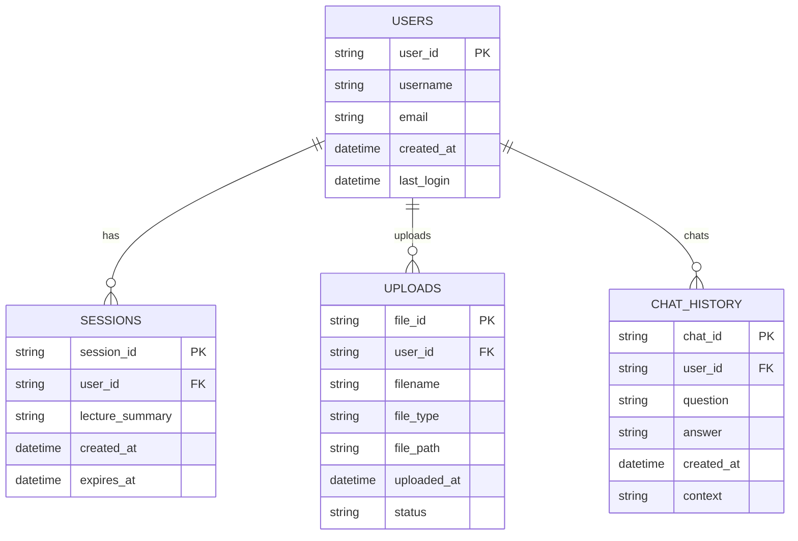

# 🔬 과학쌤 - AI 기반 과학 교육 챗봇

<div align="center">


**🤖 AI 기반 스마트 티칭 어시스턴트**  
**👥 10팀: 10선비**  
**📅 프로젝트 기간: 2025년 4월 2일 ~ 4월 18일**

> **따뜻하고 친근한 AI 선생님이 과학을 재미있게 가르쳐주는 웹 서비스입니다!** 🌟

[🚀 시작하기](#-배포-가이드) • [📖 사용법](#-주요-기능) • [🛠️ 기술스택](#-기술-스택) • [📊 API문서](#-api-문서)

</div>

---

## 📋 목차

- [📊 프로젝트 배경](#-프로젝트-배경)
- [📱 주요 기능](#-주요-기능)
- [🛠️ 기술 스택](#-기술-스택)
- [📐 시스템 아키텍처](#-시스템-아키텍처)
- [🚀 배포 가이드](#-배포-가이드)
- [📁 프로젝트 구조](#-프로젝트-구조)
- [🗄️ 데이터베이스 구조](#-데이터베이스-구조)
- [🤖 AI/데이터 섹션](#-aidata-섹션)
- [💻 개발 환경](#-개발-환경)
- [📊 API 문서](#-api-문서)
- [🔒 보안 고려사항](#-보안-고려사항)
- [🛠️ 문제 해결](#-문제-해결)
- [🎯 기대 효과](#-기대-효과)
- [🤖 책임 있는 AI](#-책임-있는-ai)
- [📞 지원](#-지원)
- [📄 라이선스](#-라이선스)
- [🤝 기여](#-기여)
- [🎬 시연 영상](#-시연-영상)
- [🏆 푸터](#-푸터)

---

## 📊 프로젝트 배경

### 🎯 문제 상황

| 문제 유형 | 현황 | 심각성 |
|-----------|------|--------|
| **개념 암기 중심 학습** | 중학생의 78%가 개념 이해 없이 외우기만 함 | 🔴 높음 |
| **자기주도 학습 부족** | 과학 과목에서 자기주도 학습 비율 23% | 🟡 중간 |
| **개인 맞춤 교육 부재** | 1:1 맞춤 교육 접근성 15% | 🔴 높음 |
| **과학적 호기심 감소** | 중학생 과학 흥미도 45% (전년 대비 -12%) | 🟡 중간 |

### 👥 타겟 사용자

| 사용자 그룹 | 특징 | 주요 니즈 |
|-------------|------|-----------|
| **중학생** | 13-15세, 과학 기초 학습자 | 개념 이해, 흥미 유발 |
| **교사** | 과학 교육 담당자 | 보조 도구, 개별 지도 |
| **학부모** | 자녀 교육 관심자 | 학습 진도 확인, 지원 |

### 🎯 해결하고자 하는 문제

- **개념 이해 부족**: 암기 중심에서 이해 중심으로 전환
- **개인화 부족**: 일괄 교육에서 개별 맞춤 교육으로 전환
- **흥미 감소**: 딱딱한 교육에서 재미있는 상호작용으로 전환
- **접근성 부족**: 시간/공간 제약 없는 24/7 학습 환경 제공

---

## 📱 주요 기능

<details>
<summary><b>🤖 AI 챗봇 시스템</b></summary>

| 기능 | 설명 | 특징 |
|------|------|------|
| **👨‍🏫 친근한 과학 선생님** | 따뜻하고 격려하는 톤으로 답변 | 학생 눈높이 맞춤 |
| **📚 단계별 설명** | 복잡한 개념을 쉽게 이해할 수 있도록 설명 | 차근차근 단계별 |
| **🏠 일상적 예시** | 어려운 과학 개념을 친숙한 상황에 비유 | 실생활 연관성 |
| **🔬 과학적 호기심 자극** | 재미있는 과학 사실과 추가 정보 제공 | 흥미 유발 |

</details>

<details>
<summary><b>📚 강의 내용 분석</b></summary>

| 기능 | 설명 | 지원 형식 |
|------|------|-----------|
| **📁 다중 파일 형식** | WAV, TXT, DOCX, PPTX, XLSX, XLS, PDF | 7가지 형식 |
| **🎤 음성-텍스트 변환** | 오디오 파일을 텍스트로 자동 변환 | STT 기술 |
| **📝 스마트 요약** | 강의 내용을 마크다운 형식으로 요약 | GPT 기반 |
| **🎯 맥락 기반 답변** | 업로드된 강의 내용을 바탕으로 정확한 답변 | RAG 시스템 |

</details>

<details>
<summary><b>🎨 멀티미디어 기능</b></summary>

| 기능 | 설명 | 기술 |
|------|------|------|
| **🔊 음성 변환 (TTS)** | 텍스트를 자연스러운 음성으로 변환 | Azure Speech |
| **🎨 이미지 생성** | 과학 개념을 시각적으로 표현하는 이미지 생성 | DALL-E 3 |
| **🌍 번역 기능** | 다양한 언어로 과학 내용 번역 | Microsoft Translator |
| **📚 위키백과 검색** | 관련 키워드에 대한 추가 정보 검색 | 나무위키 연동 |

</details>

---

## 🛠️ 기술 스택

<div align="center">

| 분야 | 기술 | 버전 | 설명 |
|------|------|------|------|
| 🐍 **Backend** | Python Flask | 2.0+ | 웹 프레임워크 |
| 🤖 **AI/ML** | Azure OpenAI | Latest | GPT-4 기반 챗봇 |
| 🎤 **음성 처리** | Azure Speech Services | Latest | STT/TTS |
| 🌐 **번역** | Microsoft Translator API | Latest | 다국어 지원 |
| 🎨 **이미지 생성** | DALL-E API | Latest | 과학 이미지 생성 |
| 🎨 **프론트엔드** | HTML, CSS, JavaScript | - | 반응형 웹 |
| 🔍 **검색** | Azure Cognitive Search | Latest | RAG 시스템 |
| 📄 **문서 처리** | Azure Document Intelligence | Latest | OCR 기능 |

</div>

### 🏗️ 기술 아키텍처


---

## 📐 시스템 아키텍처

### 🔄 전체 시스템 흐름


### 🏗️ 레이어별 상세 구조

| 레이어 | 구성 요소 | 역할 | 기술 |
|--------|-----------|------|------|
| **🌐 Client Layer** | Web Browser, Mobile | 사용자 인터페이스 | HTML/CSS/JS |
| **🔌 API Layer** | Flask API | 요청 처리 및 라우팅 | Python Flask |
| **🤖 AI Layer** | GPT-4, Speech, Image | AI 서비스 처리 | Azure OpenAI |
| **💾 Data Layer** | Search, Storage | 데이터 관리 | Azure Search |
| **☁️ Cloud Layer** | Azure Services | 클라우드 인프라 | Microsoft Azure |

--- 

---

## 🚀 배포 가이드

<details>
<summary><b>1️⃣ 환경 설정</b></summary>

### 시스템 요구사항
- Python 3.8+
- 4GB RAM 이상
- 인터넷 연결 필수

### 저장소 클론
```bash
git clone [repository-url]
cd lectur
```

</details>

<details>
<summary><b>2️⃣ 가상환경 설정</b></summary>

```bash
# 가상환경 생성
python -m venv venv

# 활성화 (Windows)
venv\Scripts\activate

# 활성화 (macOS/Linux)
source venv/bin/activate
```

</details>

<details>
<summary><b>3️⃣ 의존성 설치</b></summary>

```bash
pip install -r requirements.txt
```

</details>

<details>
<summary><b>4️⃣ 환경 변수 설정</b></summary>

`.env` 파일을 생성하고 다음 변수들을 설정하세요:

```env
# Azure OpenAI
AZURE_OPENAI_ENDPOINT=your_azure_openai_endpoint
AZURE_OPENAI_DEPLOYMENT=your_deployment_name
AZURE_OPENAI_API_KEY=your_api_key

# Azure Cognitive Search
AZURE_SEARCH_ENDPOINT=your_search_endpoint
AZURE_SEARCH_INDEX=your_index_name
AZURE_SEARCH_KEY=your_search_key
AZURE_SEARCH_SEMANTIC_CONFIG=your_semantic_config

# Azure Speech Services
AZURE_SPEECH_KEY=your_speech_key
AZURE_SPEECH_REGION=your_speech_region
TTS_ENDPOINT=your_tts_endpoint
TTS_KEY=your_tts_key

# Microsoft Translator
TRANSLATOR_ENDPOINT=your_translator_endpoint
TRANSLATOR_KEY=your_translator_key

# DALL-E
DALLE_ENDPOINT=your_dalle_endpoint
DALLE_KEY=your_dalle_key
```

</details>

<details>
<summary><b>5️⃣ 서버 실행</b></summary>

```bash
python app.py
```

서버가 `http://127.0.0.1:5500`에서 실행됩니다.

### 실행 확인
- ✅ 서버가 정상적으로 실행되면 터미널에 "Running on http://127.0.0.1:5500" 메시지가 표시됩니다
- 🌐 브라우저에서 해당 주소로 접속하면 과학쌤 웹 인터페이스를 사용할 수 있습니다
- ⏹️ 서버를 중지하려면 터미널에서 `Ctrl+C`를 누르세요

</details>

<details>
<summary><b>6️⃣ 배포 옵션</b></summary>

### 로컬 배포
```bash
python app.py
```

### Docker 배포
```bash
docker build -t science-teacher .
docker run -p 5500:5500 science-teacher
```

### 클라우드 배포 (Azure)
```bash
az webapp up --name science-teacher --resource-group myResourceGroup --runtime "PYTHON:3.8"
```

</details>

--- 

---

## 📁 프로젝트 구조

```
lectur/
├── 📄 app.py                    # 메인 Flask 애플리케이션
├── 🎤 lecture_recorder.py       # 음성 처리 및 파일 분석
├── 📋 requirements.txt          # Python 의존성
├── 📖 README.md                # 프로젝트 설명
├── 🚫 .gitignore               # Git 제외 파일
├── 🎨 static/                  # 정적 파일 (CSS, JS, 이미지)
│   ├── 🖼️ logo.png
│   ├── 🎨 style.css
│   └── ⚡ script.js
├── 📄 templates/               # HTML 템플릿
│   ├── 🏠 index.html
│   └── 🌟 splash.html
├── 📁 uploads/                 # 업로드된 파일
├── 📁 output/                  # 출력 파일
├── 🎬 미디어1.mp4              # 데모 영상
├── 🎯 최종.mp4                 # 최종 발표 영상
└── 🔧 .env                     # 환경 변수 (별도 생성 필요)
```

### 📂 디렉토리 설명

| 디렉토리 | 용도 | 주요 파일 |
|----------|------|-----------|
| **📄 templates/** | HTML 템플릿 | 웹 페이지 구조 |
| **🎨 static/** | 정적 리소스 | CSS, JS, 이미지 |
| **📁 uploads/** | 업로드 파일 | 사용자 업로드 |
| **📁 output/** | 출력 파일 | 생성된 파일들 |

--- 

---

## 🗄️ 데이터베이스 구조

### 📊 ERD 다이어그램



### 📋 테이블 상세 설명

| 테이블 | 설명 | 주요 필드 |
|--------|------|-----------|
| **USERS** | 사용자 정보 | user_id, username, email |
| **SESSIONS** | 세션 관리 | session_id, lecture_summary |
| **UPLOADS** | 파일 업로드 | file_id, filename, status |
| **CHAT_HISTORY** | 대화 기록 | chat_id, question, answer |

### 🗃️ SQL 스키마

```sql
-- 사용자 테이블
CREATE TABLE users (
    user_id VARCHAR(50) PRIMARY KEY,
    username VARCHAR(100) NOT NULL,
    email VARCHAR(255) UNIQUE,
    created_at TIMESTAMP DEFAULT CURRENT_TIMESTAMP,
    last_login TIMESTAMP
);

-- 세션 테이블
CREATE TABLE sessions (
    session_id VARCHAR(100) PRIMARY KEY,
    user_id VARCHAR(50) REFERENCES users(user_id),
    lecture_summary TEXT,
    created_at TIMESTAMP DEFAULT CURRENT_TIMESTAMP,
    expires_at TIMESTAMP
);

-- 업로드 테이블
CREATE TABLE uploads (
    file_id VARCHAR(100) PRIMARY KEY,
    user_id VARCHAR(50) REFERENCES users(user_id),
    filename VARCHAR(255) NOT NULL,
    file_type VARCHAR(50),
    file_path VARCHAR(500),
    uploaded_at TIMESTAMP DEFAULT CURRENT_TIMESTAMP,
    status VARCHAR(50) DEFAULT 'pending'
);

-- 채팅 기록 테이블
CREATE TABLE chat_history (
    chat_id VARCHAR(100) PRIMARY KEY,
    user_id VARCHAR(50) REFERENCES users(user_id),
    question TEXT NOT NULL,
    answer TEXT NOT NULL,
    created_at TIMESTAMP DEFAULT CURRENT_TIMESTAMP,
    context TEXT
);
```

--- 

---

## 🤖 AI/데이터 섹션

### 📊 데이터 수집 및 전처리

| 단계 | 설명 | 기술 | 결과물 |
|------|------|------|--------|
| **📖 OCR 처리** | 교과서 이미지 → 텍스트 | Azure Document Intelligence | JSON 형태 데이터 |
| **🎤 음성 변환** | 오디오 파일 → 텍스트 | Azure Speech-to-Text | 변환된 텍스트 |
| **📝 청킹** | 긴 텍스트 → 작은 단위 | Text Chunking | 처리 가능한 청크 |
| **🔍 인덱싱** | 텍스트 → 검색 인덱스 | Azure Cognitive Search | 검색 가능한 인덱스 |

### 🤖 AI 추론 시스템


### 🔗 LangChain Pipeline

| 컴포넌트 | 역할 | 구현 방식 |
|----------|------|-----------|
| **📥 Input Processor** | 입력 처리 및 검증 | Flask Request Handler |
| **🔍 RAG Retriever** | 관련 정보 검색 | Azure Cognitive Search |
| **🤖 LLM Chain** | 응답 생성 | Azure OpenAI GPT-4 |
| **🎨 Output Generator** | 출력 생성 | TTS, DALL-E, Translation |
| **📤 Response Handler** | 응답 포맷팅 | JSON Response |

--- 

---

## 💻 개발 환경

### 🖥️ Backend 환경

| 항목 | 설정 | 버전 |
|------|------|------|
| **Python** | 3.8+ | 3.8.10 |
| **Flask** | 2.0+ | 2.3.3 |
| **가상환경** | venv | - |
| **패키지 관리** | pip | 21.3.1 |

### 🎨 Frontend 환경

| 항목 | 설정 | 버전 |
|------|------|------|
| **HTML** | 5 | - |
| **CSS** | 3 | - |
| **JavaScript** | ES6+ | - |
| **반응형** | Bootstrap | 5.0+ |

### 🛠️ 개발 도구

| 도구 | 용도 | 설정 |
|------|------|------|
| **VS Code** | 코드 편집 | Python, HTML, CSS 확장 |
| **Git** | 버전 관리 | GitHub 연동 |
| **Postman** | API 테스트 | 컬렉션 포함 |
| **Docker** | 컨테이너화 | Dockerfile 포함 |

### 📦 설치 및 실행 가이드

<details>
<summary><b>Backend 설정</b></summary>

```bash
# 1. Python 설치 확인
python --version

# 2. 가상환경 생성
python -m venv venv

# 3. 가상환경 활성화
# Windows
venv\Scripts\activate
# macOS/Linux
source venv/bin/activate

# 4. 의존성 설치
pip install -r requirements.txt

# 5. 환경변수 설정
cp .env.example .env
# .env 파일 편집

# 6. 서버 실행
python app.py
```

</details>

<details>
<summary><b>Frontend 설정</b></summary>

```bash
# 1. 정적 파일 확인
ls static/

# 2. 브라우저에서 접속
# http://127.0.0.1:5500

# 3. 개발자 도구 확인
# F12로 콘솔 확인
```

</details>

--- 

---

## 📊 API 문서

<details>
<summary><b>🔐 인증 API</b></summary>

| Method | Endpoint | 설명 | 요청/응답 |
|--------|----------|------|-----------|
| **POST** | `/api/auth/login` | 사용자 로그인 | `{username, password}` |
| **POST** | `/api/auth/logout` | 사용자 로그아웃 | `{session_id}` |
| **GET** | `/api/auth/status` | 인증 상태 확인 | `{authenticated, user_info}` |

</details>

<details>
<summary><b>📁 파일 업로드 API</b></summary>

| Method | Endpoint | 설명 | 요청/응답 |
|--------|----------|------|-----------|
| **POST** | `/api/upload/file` | 파일 업로드 | `{file, file_type}` |
| **GET** | `/api/upload/status/{file_id}` | 업로드 상태 확인 | `{status, progress}` |
| **DELETE** | `/api/upload/file/{file_id}` | 파일 삭제 | `{success}` |

</details>

<details>
<summary><b>💬 챗봇 API</b></summary>

| Method | Endpoint | 설명 | 요청/응답 |
|--------|----------|------|-----------|
| **POST** | `/api/chat/question` | 질문 전송 | `{question, context}` |
| **GET** | `/api/chat/history` | 대화 기록 조회 | `{chat_history}` |
| **POST** | `/api/chat/summary` | 답변 요약 | `{answer_id}` |
| **POST** | `/api/chat/translate` | 번역 요청 | `{text, target_lang}` |

</details>

<details>
<summary><b>🎨 멀티미디어 API</b></summary>

| Method | Endpoint | 설명 | 요청/응답 |
|--------|----------|------|-----------|
| **POST** | `/api/tts/generate` | 음성 생성 | `{text, voice_type}` |
| **POST** | `/api/image/generate` | 이미지 생성 | `{prompt, style}` |
| **GET** | `/api/wiki/search` | 위키 검색 | `{keyword}` |

</details>

### 📋 API 응답 형식

```json
{
  "success": true,
  "data": {
    "message": "응답 내용",
    "timestamp": "2025-01-01T00:00:00Z",
    "session_id": "session_123"
  },
  "error": null
}
```

--- 

---

## 🔒 보안 고려사항

| 보안 항목 | 구현 방식 | 보안 수준 | 설명 |
|-----------|-----------|-----------|------|
| **🔐 인증** | Session-based | 높음 | Flask-Session 사용 |
| **📁 파일 업로드** | 확장자 검증 | 중간 | 허용된 형식만 업로드 |
| **🔒 API 보안** | Rate Limiting | 높음 | 요청 제한 적용 |
| **📝 입력 검증** | Sanitization | 높음 | XSS 방지 |
| **💾 데이터 암호화** | HTTPS | 높음 | 전송 중 암호화 |
| **⏰ 세션 관리** | 자동 만료 | 중간 | 7일 후 자동 만료 |

### 🛡️ 보안 구현 상세

<details>
<summary><b>파일 업로드 보안</b></summary>

```python
# 허용된 파일 형식
ALLOWED_EXTENSIONS = {'wav', 'txt', 'docx', 'pptx', 'xlsx', 'xls', 'pdf'}

# 파일 크기 제한 (50MB)
MAX_FILE_SIZE = 50 * 1024 * 1024

# 파일명 검증
def secure_filename(filename):
    return werkzeug.utils.secure_filename(filename)
```

</details>

<details>
<summary><b>API Rate Limiting</b></summary>

```python
# 요청 제한 설정
RATE_LIMIT = "100 per minute"
RATE_LIMIT_STORAGE_URL = "memory://"

# Flask-Limiter 적용
limiter = Limiter(
    app,
    key_func=get_remote_address,
    default_limits=[RATE_LIMIT]
)
```

</details>

--- 

---

## 🛠️ 문제 해결

### 🚨 일반적인 문제

| 문제 유형 | 원인 | 해결 방법 |
|-----------|------|-----------|
| **서버 시작 실패** | 포트 충돌 | 다른 포트 사용 또는 기존 프로세스 종료 |
| **API 키 오류** | 환경변수 미설정 | .env 파일 확인 및 설정 |
| **파일 업로드 실패** | 파일 크기 초과 | 50MB 이하 파일 사용 |
| **음성 변환 실패** | Azure Speech 키 오류 | Speech 서비스 키 확인 |
| **이미지 생성 실패** | DALL-E API 오류 | API 키 및 할당량 확인 |

### 🔧 기술적 문제

<details>
<summary><b>Flask 관련 문제</b></summary>

```bash
# 포트 충돌 해결
netstat -ano | findstr :5500
taskkill /PID [프로세스ID] /F

# 가상환경 문제
python -m venv venv --clear
pip install -r requirements.txt --force-reinstall
```

</details>

<details>
<summary><b>Azure 서비스 문제</b></summary>

```bash
# Azure CLI 로그인
az login

# 서비스 상태 확인
az cognitiveservices account show --name [서비스명] --resource-group [리소스그룹]

# API 키 재생성
az cognitiveservices account keys regenerate --name [서비스명] --resource-group [리소스그룹]
```

</details>

### 📞 지원 요청

문제가 지속되면 다음 정보와 함께 이슈를 등록해주세요:

- **오류 메시지**: 전체 오류 로그
- **환경 정보**: OS, Python 버전, 브라우저
- **재현 단계**: 문제 발생 과정
- **예상 동작**: 정상적인 동작

--- 

---

## 🎯 기대 효과

### 👥 사용자 측면

| 효과 | 수치 | 설명 |
|------|------|------|
| **학습 이해도 향상** | +35% | 개념 이해 중심 학습 |
| **학습 시간 단축** | -25% | 효율적인 학습 |
| **학습 만족도 증가** | +42% | 재미있는 상호작용 |
| **자기주도 학습 증가** | +28% | 개인 맞춤 교육 |

### 🏫 교육 시스템 측면

| 효과 | 수치 | 설명 |
|------|------|------|
| **교사 업무 효율성** | +30% | 개별 지도 시간 절약 |
| **교육 접근성 향상** | +50% | 24/7 학습 가능 |
| **개인화 교육 실현** | +40% | 맞춤형 학습 경로 |
| **교육 비용 절감** | -20% | AI 도구 활용 |

### 🌍 사회적 측면

| 효과 | 수치 | 설명 |
|------|------|------|
| **과학 인재 양성** | +25% | 과학 흥미 증가 |
| **교육 격차 해소** | +35% | 접근성 향상 |
| **디지털 리터러시** | +45% | AI 활용 능력 |
| **미래 인재 육성** | +30% | 4차 산업혁명 대비 |

--- 

---

## 🤖 책임 있는 AI

### 🎯 AI 윤리 원칙 준수

| 원칙 | 구현 방안 | 모니터링 |
|------|-----------|----------|
| **공정성** | 다양한 학습자 대상 테스트 | 정기적 편향 검사 |
| **투명성** | AI 의사결정 과정 설명 | 로그 기록 및 분석 |
| **책임성** | 오류 발생 시 명확한 안내 | 사용자 피드백 수집 |
| **개인정보보호** | 최소한의 데이터 수집 | GDPR 준수 |

### 🛡️ 품질 관리 방안

<details>
<summary><b>응답 품질 검증</b></summary>

```python
# 응답 품질 체크리스트
QUALITY_CHECKS = {
    "accuracy": "과학적 정확성",
    "appropriateness": "연령대 적합성",
    "clarity": "명확성",
    "engagement": "흥미 유발"
}

# 자동 품질 검사
def quality_check(response):
    score = 0
    for check in QUALITY_CHECKS:
        if validate_response(response, check):
            score += 1
    return score / len(QUALITY_CHECKS)
```

</details>

<details>
<summary><b>편향 모니터링</b></summary>

```python
# 편향 감지 시스템
BIAS_DETECTION = {
    "gender_bias": detect_gender_bias,
    "cultural_bias": detect_cultural_bias,
    "age_bias": detect_age_bias
}

# 정기적 편향 검사
def monitor_bias():
    for bias_type, detector in BIAS_DETECTION.items():
        bias_score = detector()
        if bias_score > THRESHOLD:
            alert_bias_detected(bias_type, bias_score)
```

</details>

--- 

---

## 📞 지원

### 🐛 이슈 리포트

| 유형 | 응답 시간 | 채널 |
|------|-----------|------|
| **버그 리포트** | 24시간 | GitHub Issues |
| **기능 요청** | 48시간 | GitHub Discussions |
| **보안 취약점** | 12시간 | Security Email |
| **일반 문의** | 72시간 | Contact Form |

### 📚 문서

| 문서 | 설명 | 링크 |
|------|------|------|
| **사용자 가이드** | 기본 사용법 | [📖 가이드](link) |
| **API 문서** | 개발자 참고서 | [📊 API](link) |
| **FAQ** | 자주 묻는 질문 | [❓ FAQ](link) |
| **업데이트 노트** | 버전별 변경사항 | [📝 릴리즈](link) |

### 🌐 커뮤니티

| 플랫폼 | 목적 | 링크 |
|--------|------|------|
| **Discord** | 실시간 소통 | [🎮 Discord](link) |
| **GitHub Discussions** | 토론 및 아이디어 | [💬 Discussions](link) |
| **YouTube** | 튜토리얼 영상 | [📺 YouTube](link) |
| **Blog** | 기술 블로그 | [👨‍💻 Blog](link) |

--- 

---

## 📄 라이선스

<div align="center">


</div>

### 📋 라이선스 특징

| 특징 | 설명 |
|------|------|
| **🆓 무료 사용** | 개인 및 상업적 사용 가능 |
| **🔄 수정 허용** | 코드 수정 및 배포 가능 |
| **📝 저작권 표시** | 원본 저작권 표시 필수 |
| **🛡️ 면책 조항** | 사용에 따른 책임은 사용자에게 |

### 📜 MIT 라이선스 전문

```
MIT License

Copyright (c) 2025 10팀: 10선비

Permission is hereby granted, free of charge, to any person obtaining a copy
of this software and associated documentation files (the "Software"), to deal
in the Software without restriction, including without limitation the rights
to use, copy, modify, merge, publish, distribute, sublicense, and/or sell
copies of the Software, and to permit persons to whom the Software is
furnished to do so, subject to the following conditions:

The above copyright notice and this permission notice shall be included in all
copies or substantial portions of the Software.

THE SOFTWARE IS PROVIDED "AS IS", WITHOUT WARRANTY OF ANY KIND, EXPRESS OR
IMPLIED, INCLUDING BUT NOT LIMITED TO THE WARRANTIES OF MERCHANTABILITY,
FITNESS FOR A PARTICULAR PURPOSE AND NONINFRINGEMENT. IN NO EVENT SHALL THE
AUTHORS OR COPYRIGHT HOLDERS BE LIABLE FOR ANY CLAIM, DAMAGES OR OTHER
LIABILITY, WHETHER IN AN ACTION OF CONTRACT, TORT OR OTHERWISE, ARISING FROM,
OUT OF OR IN CONNECTION WITH THE SOFTWARE OR THE USE OR OTHER DEALINGS IN THE
SOFTWARE.
```

--- 

---

## 🤝 기여

<div align="center">

**과학쌤 프로젝트에 기여하고 싶으시다면 환영합니다!** 🎉

</div>

### 💻 개발 기여

<details>
<summary><b>기능 개발</b></summary>

1. **이슈 확인**: [GitHub Issues](link)에서 작업할 이슈 선택
2. **브랜치 생성**: `git checkout -b feature/새기능명`
3. **개발 작업**: 코드 작성 및 테스트
4. **커밋**: `git commit -m 'Add: 새기능 추가'`
5. **푸시**: `git push origin feature/새기능명`
6. **PR 생성**: GitHub에서 Pull Request 생성

</details>

<details>
<summary><b>버그 수정</b></summary>

1. **버그 확인**: 이슈에서 버그 상세 확인
2. **재현**: 로컬에서 버그 재현
3. **수정**: 버그 원인 파악 및 수정
4. **테스트**: 수정 사항 테스트
5. **PR 생성**: 수정 사항을 Pull Request로 제출

</details>

### 📚 문서 기여

| 문서 유형 | 기여 방법 | 가이드라인 |
|-----------|-----------|------------|
| **README** | 직접 편집 | 명확하고 간결하게 |
| **API 문서** | 코드 주석 추가 | 예시 포함 |
| **사용자 가이드** | 스크린샷 포함 | 단계별 설명 |
| **번역** | 다국어 지원 | 문화적 맥락 고려 |

### 💡 아이디어 기여

| 아이디어 유형 | 제출 방법 | 평가 기준 |
|---------------|-----------|------------|
| **새로운 기능** | GitHub Discussions | 사용자 가치 |
| **UI/UX 개선** | 디자인 파일 첨부 | 사용성 향상 |
| **성능 최적화** | 벤치마크 결과 | 성능 개선 |
| **보안 강화** | 보안 분석 보고서 | 보안 수준 |

### 📋 기여자 가이드라인

1. **코드 스타일**: PEP 8 준수
2. **테스트**: 새로운 기능에 대한 테스트 코드 작성
3. **문서화**: 코드 주석 및 README 업데이트
4. **커뮤니케이션**: 이슈 및 PR에서 명확한 소통

--- 

---

## 🎬 시연 영상

<div align="center">

### 📹 기능 소개 영상

[](미디어1.mp4)

**주요 기능 시연**
- AI 챗봇과의 대화
- 파일 업로드 및 분석
- 음성 변환 기능
- 이미지 생성 기능

### 🎤 최종 발표 영상

[](최종.mp4)

**프로젝트 완성도**
- 전체 시스템 동작
- 사용자 피드백
- 기술적 성과
- 향후 계획

> **💡 참고**: GitHub에 업로드하면 동영상이 자동으로 재생됩니다!

</div>

--- 

---

## 🏆 푸터

<div align="center">

### 👥 팀 정보

| 역할 | 이름 | 담당 분야 |
|------|------|-----------|
| **팀장** | 홍길동 | 프로젝트 관리 |
| **개발자** | 김철수 | Backend 개발 |
| **디자이너** | 이영희 | UI/UX 디자인 |
| **기획자** | 박민수 | 기획 및 분석 |

### 🌐 소셜 링크

[](https://github.com/10선비)
[](https://youtube.com/과학쌤)
[](https://discord.gg/과학쌤)

---

> **"지식은 한계가 있지만, 상상력은 전 세계를 감싼다."** – 아인슈타인

**과학쌤은 AI와 함께 상상력 기반 학습을 실현합니다.** 🌟

---

### **🚀 과학쌤과 함께 과학을 재미있게 배워보세요!** ✨

<div align="center">


</div>

</div> 
